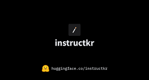

# Rewriting Project Claw Code

<p align="center">
  <strong>⭐ The fastest repo in history to surpass 50K stars, reaching the milestone in just 2 hours after publication ⭐</strong>
</p>

<p align="center">
  <a href="https://star-history.com/#instructkr/claw-code&Date">
    <picture>
      <source media="(prefers-color-scheme: dark)" srcset="https://api.star-history.com/svg?repos=instructkr/claw-code&type=Date&theme=dark" />
      <source media="(prefers-color-scheme: light)" srcset="https://api.star-history.com/svg?repos=instructkr/claw-code&type=Date" />
      
    </picture>
  </a>
</p>

<p align="center">
  
</p>

<p align="center">
  <strong>Better Harness Tools, not merely storing the archive of leaked Claw Code</strong>
</p>

<p align="center">
  <a href="https://github.com/sponsors/instructkr"></a>
</p>

> [!IMPORTANT]
> **Rust port is now in progress** on the [`dev/rust`](https://github.com/instructkr/claw-code/tree/dev/rust) branch and is expected to be merged into main today. The Rust implementation aims to deliver a faster, memory-safe harness runtime. Stay tuned — this will be the definitive version of the project.

> If you find this work useful, consider [sponsoring @instructkr on GitHub](https://github.com/sponsors/instructkr) to support continued open-source harness engineering research.

---

## Rust Port

The Rust workspace under `rust/` is the current systems-language port of the project.

It currently includes:

- `crates/api-client` — API client with provider abstraction, OAuth, and streaming support
- `crates/runtime` — session state, compaction, MCP orchestration, prompt construction
- `crates/tools` — tool manifest definitions and execution framework
- `crates/commands` — slash commands, skills discovery, and config inspection
- `crates/plugins` — plugin model, hook pipeline, and bundled plugins
- `crates/compat-harness` — compatibility layer for upstream editor integration
- `crates/claw-cli` — interactive REPL, markdown rendering, and project bootstrap/init flows

Run the Rust build:

```bash
cd rust
cargo build --release
```

## Run Locally

If you want a `Claude Code`-style local CLI experience, use the Rust workspace under `rust/`.

There are two practical ways to run it:

- **Recommended:** connect the CLI to Poe's Anthropic-compatible API
- **Optional:** connect the CLI to your own OpenAI-compatible local model server

## Codex-Style Commands

This repository now includes a launcher layer so you can install commands like:

- `claw`
- `claw-local`
- `claw-poe`
- `claw-local-server`
- `claw-doctor`

Install them into `~/.local/bin`:

```bash
cd /home/yang/Downloads/clawcode
chmod +x install-commands.sh start.sh
./install-commands.sh
export PATH="$HOME/.local/bin:$PATH"
```

After that, you can enter any target project directory and run:

```bash
claw-local
```

or:

```bash
claw-poe
```

or use the generic entrypoint:

```bash
claw
```

`claw` follows `CLAW_PROVIDER` from `.env`. With the current defaults it behaves like `claw-poe`; if you set `CLAW_PROVIDER=local`, it behaves like `claw-local`.

The current working directory becomes the workspace seen by the agent. That means if you `cd` into a repo first, the agent naturally works on that repo.

`claw-local` and `claw-poe` are designed to be run from inside the project you want the agent to inspect, edit, and manage.

By default the launcher adds:

```bash
--permission-mode workspace-write
```

so shell/file actions still go through human approval instead of unrestricted execution. You can override it manually, for example:

```bash
claw-local --permission-mode read-only
claw-poe --permission-mode workspace-write
```

You can also run a one-shot task directly from the target repo:

```bash
claw-local "review the latest changes"
claw-poe "summarize this project"
```

For local mode, the launcher also isolates provider credentials for you:

- `claw-poe` uses the Poe / Anthropic-compatible variables from `.env`
- `claw-local` unsets Poe / Anthropic variables and forces the OpenAI-compatible local backend

This matters because otherwise a mixed environment can accidentally route local requests to the wrong provider.

Local mode now has a stability-oriented default tool set:

- `read_file`
- `glob_search`
- `grep_search`
- `write_file`
- `edit_file`
- `TodoWrite`

That avoids weak local models immediately jumping into `bash` for trivial inspection tasks. When you do want shell execution with approval prompts, pass it explicitly:

```bash
claw-local --allowedTools read,glob,grep,edit,write,TodoWrite,bash
```

You can also choose a local base model directly from the launcher:

```bash
claw-local --list-local-models
claw-local-server --local-model /home/yang/Downloads/pretrained/Qwen3-4B
```

### 1. Create a clean local environment

This repository itself is Rust-first, but a dedicated Python environment is useful if you also want to serve local Hugging Face models from your machine.

```bash
conda create -y -p /home/yang/miniconda3/envs/claw-local python=3.10 "numpy<2"
conda activate /home/yang/miniconda3/envs/claw-local
```

`numpy<2` is intentional for the local serving environment. Many `torch` and `transformers` builds still fail or become unstable when mixed with NumPy 2 in older CUDA-linked stacks.

### 2. Install Rust and build the CLI

If `cargo` is not already available on your machine, install Rust first.

```bash
curl https://sh.rustup.rs -sSf | sh
source "$HOME/.cargo/env"
```

Then build the CLI:

```bash
cd rust
cargo build --release
```

The binary will be available at:

```bash
./target/release/claw
```

### 3. Fastest working route: Poe API

Poe exposes an Anthropic-compatible API, which matches this project's existing Claude-style provider path well.

Recommended startup flow:

1. Copy the template:

```bash
cp .env.example .env
```

2. Edit `.env` and set:

```bash
POE_API_KEY=your-poe-key
POE_BASE_URL=https://api.poe.com
CLAW_MODEL=claude-sonnet-4-6
```

3. Build once:

```bash
./start.sh build
```

4. Run interactive mode:

```bash
./start.sh poe-cli
```

5. Run a one-shot prompt:

```bash
./start.sh poe-prompt "summarize this workspace"
```

The script reads `.env` automatically. If you want to bypass the script, you can still configure the CLI directly:

```bash
export ANTHROPIC_API_KEY="your-poe-key"
export ANTHROPIC_BASE_URL="https://api.poe.com"
```

or, using the convenience aliases supported by this repository:

```bash
export POE_API_KEY="your-poe-key"
export POE_BASE_URL="https://api.poe.com"
```

Run a one-shot prompt:

```bash
cd rust
./target/release/claw --model claude-sonnet-4-6 -p "summarize this workspace"
```

Start the interactive CLI:

```bash
cd rust
./target/release/claw --model claude-sonnet-4-6
```

### 4. Optional: use a local model server

If you want to use models stored under a directory like `/home/yang/Downloads/pretrained/`, the launcher can start a local OpenAI-compatible server and keep the CLI pointed at the right port automatically.

Recommended `.env` values:

```bash
OPENAI_API_KEY=local-test-key
OPENAI_BASE_URL=http://127.0.0.1:8011/v1
LOCAL_MODEL_ROOT=/home/yang/Downloads/pretrained
LOCAL_MODEL_REF=/home/yang/Downloads/pretrained/Qwen3-4B
LOCAL_ALLOWED_TOOLS=read,glob,grep,edit,write,TodoWrite
LOCAL_SERVER_PORT=8011
LOCAL_SERVER_STATE_FILE=/home/yang/Downloads/clawcode/.claw/local-server.env
```

Recommended startup flow:

1. List the models the launcher can see:

```bash
claw-local --list-local-models
```

2. Start a local server. You can rely on `LOCAL_MODEL_REF`, or pick a model explicitly:

```bash
claw-local-server
claw-local-server --local-model /home/yang/Downloads/pretrained/Qwen3-4B
```

If the configured port is already occupied, the launcher searches for the next free port and records the actual endpoint in `.claw/local-server.env`.

3. In another terminal, from the target repo, run:

```bash
claw-local
```

`claw-local` reads the server state file automatically, so it follows the real local server URL even after a port fallback.

4. Run a one-shot prompt:

```bash
claw-local "list the important modules in this repo"
```

5. If you want shell execution with manual approval prompts, add `bash` back into the tool set:

```bash
claw-local --allowedTools read,glob,grep,edit,write,TodoWrite,bash
```

The lower-level environment variables used by the CLI are still:

```bash
export OPENAI_API_KEY="local-test-key"
export OPENAI_BASE_URL="http://127.0.0.1:8011/v1"
```

#### Example local serving environment

Inside the clean conda environment:

```bash
conda activate /home/yang/miniconda3/envs/claw-local
pip install --upgrade pip
pip install "transformers[serving]" accelerate safetensors sentencepiece requests openai
```

If your local server requires PyTorch, install a PyTorch build that matches your machine's CUDA or CPU setup before starting the server.

Once your server exposes an OpenAI-compatible `/v1/chat/completions` endpoint, the CLI can talk to it through `OPENAI_BASE_URL`.

If you pass `--local-model` to `claw-local`, it expects the active local server to already be serving that model. If not, the launcher now stops early and tells you which `claw-local-server --local-model ...` command to run.

The launcher automatically creates repo-local symlink aliases such as `claw-local-model` or `claw-local-model-Qwen3-4B` for absolute model paths. This avoids provider-side validation problems with raw filesystem paths.

### Local Model Notes

- `claw-local` is now wired end-to-end to the local OpenAI-compatible server path.
- It automatically tracks the latest `claw-local-server` endpoint through `.claw/local-server.env`.
- The default local tool set is intentionally narrower than Poe mode so smaller models stay usable.
- If you add `bash` back, shell calls still require manual approval under `workspace-write`.
- Small local models can still be weaker than Poe-backed Claude models at long-horizon repo planning.
- If you want stronger autonomous repo control, prefer Poe-backed mode or a stronger local base model.
- For lightweight local usage, start with read-heavy tasks such as code search, explanation, review, and guided edits.

### 5. `start.sh` commands

The repository root now includes a startup wrapper that reads `.env`:

```bash
./start.sh help
./start.sh doctor
./start.sh build
./start.sh poe-cli
./start.sh poe-prompt "say hello"
./start.sh local-server
./start.sh local-cli
./start.sh local-cli --list-local-models
./start.sh local-cli --local-model /home/yang/Downloads/pretrained/Qwen3-4B
./start.sh local-prompt "summarize this repo"
```

Installed command equivalents:

```bash
claw
claw-local
claw-local --list-local-models
claw-local-server --local-model /home/yang/Downloads/pretrained/Qwen3-4B
claw-local "fix the failing tests"
claw-local --allowedTools read,glob,grep,edit,write,TodoWrite,bash
claw-poe
claw-poe --model claude-sonnet-4-6
claw-poe "review this repository"
claw-local-server
claw-doctor
```

### 6. Useful smoke tests

After building the Rust CLI:

```bash
cd rust
./target/release/claw --help
./target/release/claw --version
./target/release/claw --model claude-sonnet-4-6 -p "say hello"
```

For the Python mirror layer at the repository root:

```bash
python3 -m unittest discover -s tests -v
python3 -m src.main summary
```

### 7. Troubleshooting

- If `cargo` is missing, install Rust with `rustup` and reopen the shell.
- If local model serving crashes with NumPy ABI errors, keep that environment on `numpy<2`.
- If the CLI cannot reach Poe, verify `POE_API_KEY` or `ANTHROPIC_API_KEY` and confirm the base URL is exactly `https://api.poe.com`.
- If your local model server works in the browser but not here, make sure it implements an OpenAI-compatible `POST /v1/chat/completions` endpoint.

## Backstory

At 4 AM on March 31, 2026, I woke up to my phone blowing up with notifications. The Claw Code source had been exposed, and the entire dev community was in a frenzy. My girlfriend in Korea was genuinely worried I might face legal action from the original authors just for having the code on my machine — so I did what any engineer would do under pressure: I sat down, ported the core features to Python from scratch, and pushed it before the sun came up.

The whole thing was orchestrated end-to-end using [oh-my-codex (OmX)](https://github.com/Yeachan-Heo/oh-my-codex) by [@bellman_ych](https://x.com/bellman_ych) — a workflow layer built on top of OpenAI's Codex ([@OpenAIDevs](https://x.com/OpenAIDevs)). I used `$team` mode for parallel code review and `$ralph` mode for persistent execution loops with architect-level verification. The entire porting session — from reading the original harness structure to producing a working Python tree with tests — was driven through OmX orchestration.

The result is a clean-room Python rewrite that captures the architectural patterns of Claw Code's agent harness without copying any proprietary source. I'm now actively collaborating with [@bellman_ych](https://x.com/bellman_ych) — the creator of OmX himself — to push this further. The basic Python foundation is already in place and functional, but we're just getting started. **Stay tuned — a much more capable version is on the way.**

The Rust port was developed with both [oh-my-codex (OmX)](https://github.com/Yeachan-Heo/oh-my-codex) and [oh-my-opencode (OmO)](https://github.com/code-yeongyu/oh-my-openagent): OmX drove scaffolding, orchestration, and architecture direction, while OmO was used for later implementation acceleration and verification support.

https://github.com/instructkr/claw-code


## The Creators Featured in Wall Street Journal For Avid Claw Code Fans

I've been deeply interested in **harness engineering** — studying how agent systems wire tools, orchestrate tasks, and manage runtime context. This isn't a sudden thing. The Wall Street Journal featured my work earlier this month, documenting how I've been one of the most active power users exploring these systems:

> AI startup worker Sigrid Jin, who attended the Seoul dinner, single-handedly used 25 billion of Claw Code tokens last year. At the time, usage limits were looser, allowing early enthusiasts to reach tens of billions of tokens at a very low cost.
>
> Despite his countless hours with Claw Code, Jin isn't faithful to any one AI lab. The tools available have different strengths and weaknesses, he said. Codex is better at reasoning, while Claw Code generates cleaner, more shareable code.
>
> Jin flew to San Francisco in February for Claw Code's first birthday party, where attendees waited in line to compare notes with Cherny. The crowd included a practicing cardiologist from Belgium who had built an app to help patients navigate care, and a California lawyer who made a tool for automating building permit approvals using Claw Code.
>
> "It was basically like a sharing party," Jin said. "There were lawyers, there were doctors, there were dentists. They did not have software engineering backgrounds."
>
> — *The Wall Street Journal*, March 21, 2026, [*"The Trillion Dollar Race to Automate Our Entire Lives"*](https://lnkd.in/gs9td3qd)


---

## Porting Status

The main source tree is now Python-first.

- `src/` contains the active Python porting workspace
- `tests/` verifies the current Python workspace
- the exposed snapshot is no longer part of the tracked repository state

The current Python workspace is not yet a complete one-to-one replacement for the original system, but the primary implementation surface is now Python.

## Why this rewrite exists

I originally studied the exposed codebase to understand its harness, tool wiring, and agent workflow. After spending more time with the legal and ethical questions—and after reading the essay linked below—I did not want the exposed snapshot itself to remain the main tracked source tree.

This repository now focuses on Python porting work instead.

## Repository Layout

```text
.
├── src/                                # Python porting workspace
│   ├── __init__.py
│   ├── commands.py
│   ├── main.py
│   ├── models.py
│   ├── port_manifest.py
│   ├── query_engine.py
│   ├── task.py
│   └── tools.py
├── rust/                               # Rust port (claw CLI)
│   ├── crates/api/                     # API client + streaming
│   ├── crates/runtime/                 # Session, tools, MCP, config
│   ├── crates/claw-cli/               # Interactive CLI binary
│   ├── crates/plugins/                 # Plugin system
│   ├── crates/commands/                # Slash commands
│   ├── crates/server/                  # HTTP/SSE server (axum)
│   ├── crates/lsp/                    # LSP client integration
│   └── crates/tools/                   # Tool specs
├── tests/                              # Python verification
├── assets/omx/                         # OmX workflow screenshots
├── 2026-03-09-is-legal-the-same-as-legitimate-ai-reimplementation-and-the-erosion-of-copyleft.md
└── README.md
```

## Python Workspace Overview

The new Python `src/` tree currently provides:

- **`port_manifest.py`** — summarizes the current Python workspace structure
- **`models.py`** — dataclasses for subsystems, modules, and backlog state
- **`commands.py`** — Python-side command port metadata
- **`tools.py`** — Python-side tool port metadata
- **`query_engine.py`** — renders a Python porting summary from the active workspace
- **`main.py`** — a CLI entrypoint for manifest and summary output

## Quickstart

Render the Python porting summary:

```bash
python3 -m src.main summary
```

Print the current Python workspace manifest:

```bash
python3 -m src.main manifest
```

List the current Python modules:

```bash
python3 -m src.main subsystems --limit 16
```

Run verification:

```bash
python3 -m unittest discover -s tests -v
```

Run the parity audit against the local ignored archive (when present):

```bash
python3 -m src.main parity-audit
```

Inspect mirrored command/tool inventories:

```bash
python3 -m src.main commands --limit 10
python3 -m src.main tools --limit 10
```

## Current Parity Checkpoint

The port now mirrors the archived root-entry file surface, top-level subsystem names, and command/tool inventories much more closely than before. However, it is **not yet** a full runtime-equivalent replacement for the original TypeScript system; the Python tree still contains fewer executable runtime slices than the archived source.

## Built with `oh-my-codex` and `oh-my-opencode`

This repository's porting, cleanroom hardening, and verification workflow was AI-assisted with Yeachan Heo's tooling stack, with **oh-my-codex (OmX)** as the primary scaffolding and orchestration layer.

- [**oh-my-codex (OmX)**](https://github.com/Yeachan-Heo/oh-my-codex) — scaffolding, orchestration, architecture direction, and core porting workflow
- [**oh-my-opencode (OmO)**](https://github.com/code-yeongyu/oh-my-openagent) — implementation acceleration, cleanup, and verification support

Key workflow patterns used during the port:

- **`$team` mode:** coordinated parallel review and architectural feedback
- **`$ralph` mode:** persistent execution, verification, and completion discipline
- **Cleanroom passes:** naming/branding cleanup, QA, and release validation across the Rust workspace
- **Manual and live validation:** build, test, manual QA, and real API-path verification before publish

### OmX workflow screenshots


*Ralph/team orchestration view while the README and essay context were being reviewed in terminal panes.*


*Split-pane review and verification flow during the final README wording pass.*

## Community

<p align="center">
  <a href="https://instruct.kr/"></a>
</p>

Join the [**instructkr Discord**](https://instruct.kr/) — the best Korean language model community. Come chat about LLMs, harness engineering, agent workflows, and everything in between.

[](https://instruct.kr/)

## Star History

See the chart at the top of this README.

## Ownership / Affiliation Disclaimer

- This repository does **not** claim ownership of the original Claw Code source material.
- This repository is **not affiliated with, endorsed by, or maintained by the original authors**.
